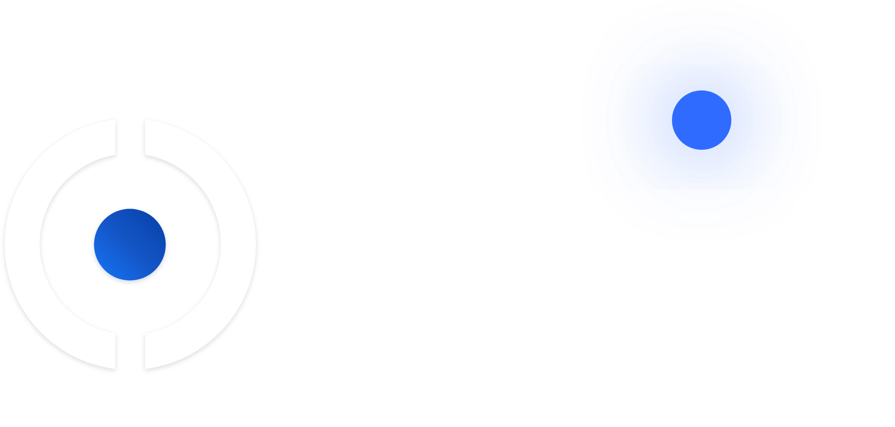
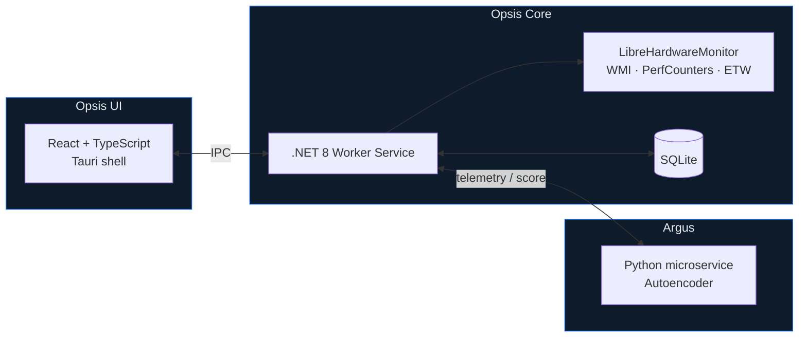

<div align="center">



### Observe. Analyze. Optimize.

Real-time system telemetry, process intelligence, and ML-driven anomaly detection for Windows 10 & 11.

<br />


<br />

[**Watch the demo**](#-demo) · [**Download**](#-download) · [**How it works**](#-architecture) · [**Roadmap**](#-roadmap)

</div>

---

## 🎬 Demo

> [!NOTE]
> **This repository is the public home of Opsis.** It hosts the demo video, release notes, and signed installers. The application source code is kept in a private repository.

<div align="center">

[https://github.com/user-attachments/assets/REPLACE-WITH-UPLOADED-VIDEO-URL](https://github.com/user-attachments/assets/4a5f5c80-026e-4a58-b19b-4179fde635d7)

*Full walkthrough — live telemetry, process tree, and Argus anomaly scoring.*

</div>

---

## What is Opsis?

Windows already tells you *that* something is slow. Opsis tells you **what changed, when, and whether it's normal for your machine.**

Most consumer "optimiser" tools are theatre — one-click cleaners with animated progress bars and no measurable effect. Opsis takes the opposite position: it is a **local-first observability platform** built for people who actually read the numbers. Developers, sysadmins, engineers, power users.

Everything runs on your machine. No telemetry upload, no account required, no cloud dependency.

<table>
<tr>
<td width="50%" valign="top">

### 📊 Live telemetry
Sub-second sampling of CPU, RAM, GPU, disk and network via **LibreHardwareMonitor**, WMI and Windows Performance Counters — including per-core load, thermals and clock speeds.

</td>
<td width="50%" valign="top">

### 🌳 Process intelligence
Processes grouped by **parent PID**, so a browser with 40 renderer children reads as one collapsible tree instead of 40 rows of noise. Resource attribution rolls up the tree.

</td>
</tr>
<tr>
<td width="50%" valign="top">

### 🧠 Argus anomaly detection
An autoencoder trained on **your** baseline flags behaviour that's abnormal *for your machine* — not against a generic threshold someone picked in a lab.

</td>
<td width="50%" valign="top">

### 📈 Historical analytics
Every sample is persisted locally to SQLite. Scrub back through hours or weeks to correlate a slowdown with the process that actually caused it.

</td>
</tr>
</table>

---

## 🧠 Argus

Argus is the anomaly-detection subsystem behind Opsis's risk scoring, and the hardest design problem in the project.

**The problem with shipping a pre-trained model.** A gaming rig with a 4090 and a fanless ultrabook have wildly different "normal". Ship one machine's baseline to everyone and you generate false positives on day one — which trains users to ignore the alerts entirely, at which point the feature is worse than useless.

**The approach.**

```
Day 0          →  Statistical heuristics ship immediately. Useful from first launch.
Warm-up window →  Per-user baseline collected locally and persisted to SQLite.
Model active   →  A personalised autoencoder scores each tick against that baseline.
```

The model takes six normalised inputs — `CpuShare`, `RamShare`, `CpuRate`, `RamRate`, `SystemCpuRate`, `SystemRamRate` — and emits a single scalar reconstruction error per tick. High error means "this doesn't look like anything I've seen from this machine before." All derived state (severity bands, trend, flags) is computed in the frontend from that one number, keeping the data contract deliberately narrow.

The UI surfaces its own maturity honestly: baseline completeness %, days of data collected, samples stored, and last retrain timestamp. You always know how much to trust it.

---

## 🏗 Architecture

Opsis is a three-process system. The split is deliberate: privileged hardware access, UI rendering, and ML inference have genuinely different requirements, so they don't share a runtime.



<details>
<summary><b>Why this stack?</b></summary>

<br />

| Decision | Reasoning |
|---|---|
| **.NET 8 for the collection engine** | First-class access to WMI, Performance Counters and ETW. Doing this from Rust or Node means fighting interop for no benefit — the workload is I/O-bound, not compute-bound. |
| **Tauri over Electron** | A ~10 MB installer instead of ~150 MB, and materially lower idle RAM. A monitoring tool that itself eats 400 MB of RAM undermines its own pitch. |
| **Rust present but not written** | Tauri's shell is Rust; the application logic isn't. Using it where it adds nothing would be resume-driven development. |
| **SQLite, embedded** | Historical analytics needs real queries over time-series data. A local embedded DB gives that with zero setup and zero network surface. |
| **Python only for ML** | Isolated to the one place the ecosystem genuinely wins. It's a separate process, so a model failure degrades Argus rather than taking down telemetry. |

</details>

---

## 🛠 Built with

<div align="center">


</div>

---

## 🗺 Roadmap

| | Phase | Scope |
|---|---|---|
| ✅ | **1 · Telemetry** | Hardware sampling, live dashboard, monitoring control |
| ✅ | **2 · Process Management** | Parent-PID process tree, resource attribution, actions |
| 🔨 | **3 · Anomaly Scoring** | Argus heuristics, ETW integration, risk surface |
| 🔨 | **4 · Historical Analytics** | Time-series persistence, retrospective analysis |
| ⏳ | **5 · ML Prediction** | Autoencoder microservice, per-user baselines, retraining |
| ⏳ | **6 · Launch** | Packaging, code signing, licensing, public release |

### Beyond v1 — Opsis Cloud (optional)

> [!NOTE]
> A long-term direction, not a committed feature. Nothing here exists yet, no version of Opsis sends data anywhere today, and if it ever ships it's a service you choose to turn on — never something you have to turn off.

The local-first design has a real cost. Argus has to collect a baseline on your machine before it can say anything useful, its training data lives in your SQLite file and dies with a clean install, and inference — however light — runs on the machine you're trying to measure.

**Opsis Cloud** would be an optional hosted tier addressing exactly that: baselines stored and synced server-side, model training and inference running off-device. The upside is a lighter local footprint, baselines that survive a reinstall or follow you to a new machine, and models that improve without waiting on one machine's warm-up window.

Two constraints on it, decided now rather than later:

- **Opt-in, and only opt-in.** Local-only mode is the default and stays fully functional forever.
- **It doesn't gate the product.** Core monitoring, the process tree, and local anomaly detection never move behind a cloud account.

That said — this is distant. The six phases above come first.

---

## 📥 Download

> [!IMPORTANT]
> Opsis is in **preview**, and **early versions are free**. Installers will be published to this repository's [Releases](../../releases) page.

Charging for something unfinished is a good way to build a bad reputation. Opsis stays free until two things are true: the feature set is genuinely consumer-ready, and there's a large enough user base to have shaken out the hardware-specific bugs that only real machines find. Paid licensing arrives after that, not before.

| | |
|---|---|
| **Platform** | Windows 10 (1809+) / Windows 11, x64 |
| **Installer** | `.msi` and `.exe` — self-contained, no runtime prerequisites |
| **Preview builds** | Free, full functionality, no account required |
| **Licence, eventually** | One-time purchase with a 30-day trial. No subscription, no upsells. Pricing announced when it applies. |

**[→ Go to Releases](../../releases)**

---

## ❓ FAQ

<details>
<summary><b>Does Opsis send my data anywhere?</b></summary>
<br />
No. Telemetry, baselines and history are stored locally in SQLite on your machine. Argus trains and runs on-device. There is no account and no cloud backend. A hosted tier is a <a href="#beyond-v1--opsis-cloud-optional">long-term possibility</a>, but it would be opt-in, and local-only mode remains the default and stays fully functional.
</details>

<details>
<summary><b>Is Opsis free?</b></summary>
<br />
For now, yes — preview builds are free and fully functional. Paid licensing begins once Opsis is genuinely consumer-ready and has enough real-world users behind it. When it does, it's a one-time purchase with a trial, not a subscription.
</details>

<details>
<summary><b>Is this another "PC booster"?</b></summary>
<br />
No. There is no one-click clean, no registry "repair", no fake scan animation. Opsis shows you real measurements and lets you act on them yourself. Every action it takes is one you explicitly chose.
</details>

<details>
<summary><b>Why is the source code private?</b></summary>
<br />
Opsis is a commercial product. This repository exists so the demo, release notes and installers are publicly available — happy to walk through architecture and specific implementation details on request.
</details>

<details>
<summary><b>How much overhead does it add?</b></summary>
<br />
Keeping the monitor's own footprint negligible is a hard design constraint — it's the reason for Tauri over Electron and for a native collection engine. Measured figures will be published with the first release.
</details>

---

## 👤 About

Opsis is designed and built solo by **Theo Scarton Lago** — Software Engineering student at Lancaster University — covering architecture, backend, frontend, ML, UI design, packaging and go-to-market.

Questions about any part of it — the ETW integration, the anomaly-detection design, the IPC layer — are welcome. Contact details are on my [GitHub profile](https://github.com/Theo-Lake).

<div align="center">
<br />

<sub>© 2026 Theo Scarton Lago. Opsis and Argus are proprietary software. All rights reserved.</sub>

</div>
